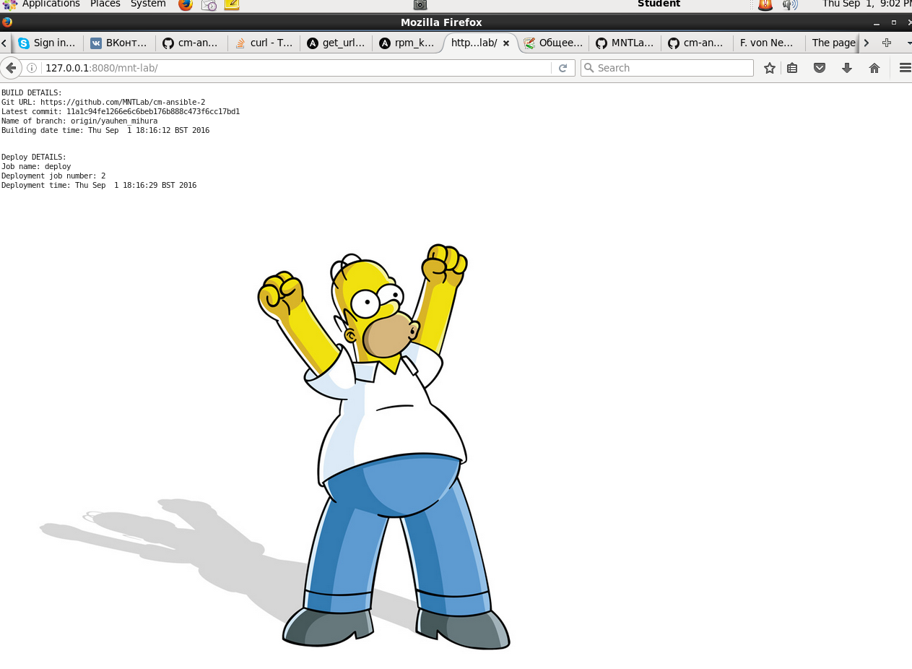
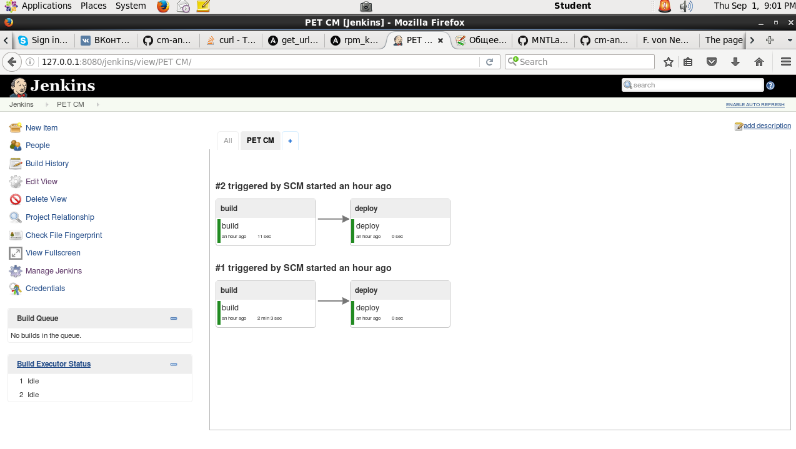
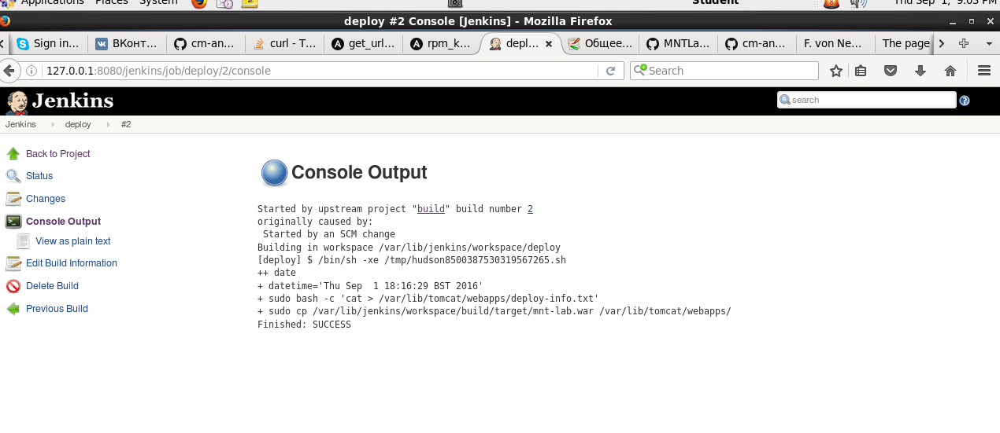
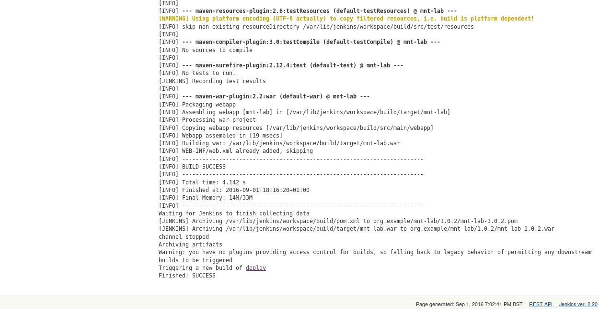
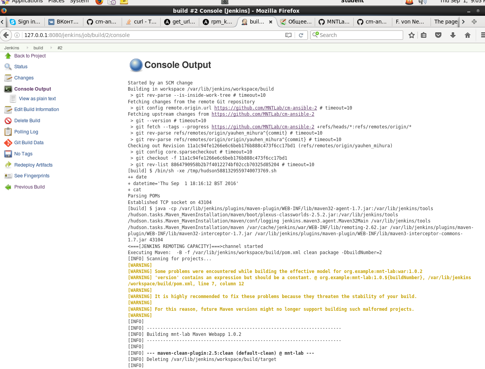

MTN.*NIX.11 Automated Environment Configuration Management
---

***Student***: [Yauhen Mihura](https://upsa.epam.com/workload/employeeView.do?employeeId=4060741400038707325#emplTab=general)

Completed next Home Task 2

* Created ```Ansible playbook``` ([provision.yml](vagrant/ansible/provision.yml))
* ```Jenkins Role``` ([main.yml](vagrant/ansible/roles/jenkins/tasks/main.yml))
* ```Tomcat Role``` ([main.yml](vagrant/ansible/roles/tomcat/tasks/main.yml))
* ```Nginx Role``` ([main.yml](vagrant/ansible/roles/web/tasks/main.yml))
* ```Java Role``` ([main.yml](vagrant/ansible/roles/java/tasks/main.yml))

<b>Result:</b> <br>- [http://localhost:8080/mnt-lab](#yakor)
<br>- [http://localhost:8080/jenkins](#yakor1)
<br>- [Jobs console output](#yakor2)
<br>- [Jobs Pipeline](#yakor3)

<h2><a id="yakor">Deployed application to Tomcat</a></h2>


<h2><a id="yakor1">Jenkins jobs</a></h2>


<h2><a id="yakor3">Jenkins Pipeline</a></h2>


<h2><a id="yakor2">Jobs console output</a></h2>



