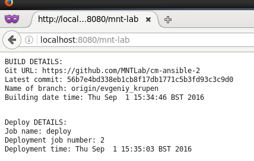
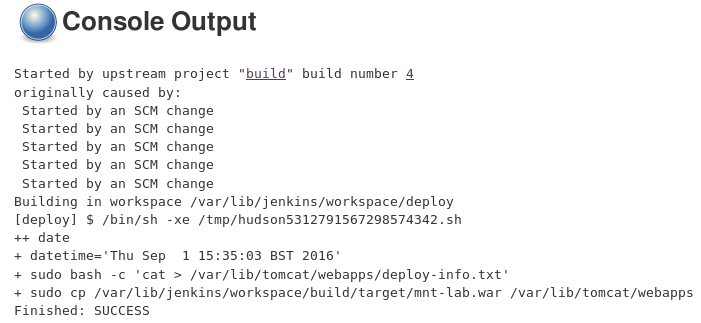
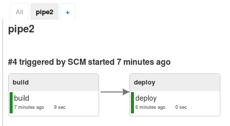

MTN.*NIX.11 Automated Environment Configuration Management
---

***Student***: [Evgeniy_Krupen](https://upsa.epam.com/workload/employeeView.do?employeeId=4060741400038655484#emplTab=general)

Ansible Home Task
------------------
Report
------------------

1. I created roles for Nginx, Tomcat, Jenkins. Also Tomcat and Jenkins depend on the Java role.
2. All configuration files were replaced by module template (folder ***templates*** in each roles) 
3. Nginx, Tomcat, Jenkins were restarted by handlers (***handlers/main.yml***)
4. I used variables in provision.yml file and put it in default/main.yml for each roles below:
    - nginx_repo: http://nginx.org/packages/centos/6/noarch/RPMS/nginx-release-centos-6-0.el6.ngx.noarch.rpm
    - nginx_port: 8080
    - tomcat_port: 9080
    - jenkins_prefix: --prefix=/jenkins
    - jenkins_port: 8081

    I would be glad if you could check it :
     - [vagrant/ansible/provision.yml](vagrant/ansible/provision.yml)
     
     ----------------------------JAVA ROLE----------------------------------------------------
     - [vagrant/ansible/roles/java/tasks/main.yml](vagrant/ansible/roles/java/tasks/main.yml)
     
     ----------------------------JENKINS ROLE-------------------------------------------------
     - [vagrant/ansible/roles/jenkins/defaults/main.yml](vagrant/ansible/roles/jenkins/defaults/main.yml)
     - [vagrant/ansible/roles/jenkins/tasks/main.yml](vagrant/ansible/roles/jenkins/tasks/main.yml)
     - [vagrant/ansible/roles/jenkins/handlers/main.yml](vagrant/ansible/roles/jenkins/handlers/main.yml)
     - [vagrant/ansible/roles/jenkins/meta/main.yml](vagrant/ansible/roles/jenkins/meta/main.yml)
     
     ----------------------------TOMCAT ROLE-------------------------------------------------
     - [vagrant/ansible/roles/tomcat/defaults/main.yml](vagrant/ansible/roles/tomcat/defaults/main.yml)
     - [vagrant/ansible/roles/tomcat/handlers/main.yml](vagrant/ansible/roles/tomcat/handlers/main.yml)
     - [vagrant/ansible/roles/tomcat/meta/main.yml](vagrant/ansible/roles/tomcat/meta/main.yml)
     - [vagrant/ansible/roles/tomcat/tasks/main.yml](vagrant/ansible/roles/tomcat/tasks/main.yml)
     
      ----------------------------NGINX ROLE-------------------------------------------------
     - [vagrant/ansible/roles/web/defaults/main.yml](vagrant/ansible/roles/web/defaults/main.yml)
     - [vagrant/ansible/roles/web/handlers/main.yml](vagrant/ansible/roles/web/handlers/main.yml)
     - [vagrant/ansible/roles/web/tasks/main.yml](vagrant/ansible/roles/web/tasks/main.yml)
     
     
     ***Screenshots***
     - Success
     
     
     
     - Deploy job
     
    
    
     - Pipeline
     
     
     
     
     
Thank you for you attention.
I am looking forward to receiving your reply.
     
     
